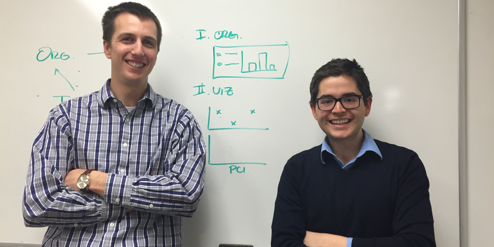

```{r createDocument, eval=FALSE, echo=FALSE}

library(rmarkdown)
rmarkdown::run('deliverable.Rmd') # for interactive document

## For deployment to shinyapps.io only!
## library(shinyapps)
## shinyapps::deployApp(appDir=getwd(), appName="yale-oei")

```

```{r navbar, echo = FALSE, eval=FALSE, message=FALSE}
## This is the original navbar - it was replaced by
## the HTML code in toc.html
## shinyAppDir(
##     "navbar/",
##     options=list(width="100%", height=75)
##   )
```

```{r tableOfContents, eval=TRUE, echo=FALSE}
## Title, authors, and table of contents will be included in this HTML
## file once it is all finalized to get linking to work properly
## Add this back to YAML header to get these ##
## title: "Shining a Light on ~~Big~~ Data: Promoting a Data Fluent Culture"
## author:
## - Stefan Avey
## - Robert Amezquita
## output:
##     html_document:
##        toc: true
##        toc_depth: 2

includeHTML("toc/toc.html")
```

```{r read-in-data, echo = FALSE, eval=TRUE, message=FALSE}
## Using Iris dataset
library(ggplot2)
library(reshape2)
library(GGally)
library(plyr)
data(iris)
```

# Introduction
```{r intro, echo = FALSE, eval=TRUE}
includeMarkdown("introduction/intro.md")
```

[Back to Table of Contents](./deliverable.Rmd#toc)

# Part 1 - Organization
## Data Types
```{r datatypes, echo = FALSE, eval=TRUE}
includeMarkdown("organization/intro.md")
```

[Back to Table of Contents](./deliverable.Rmd#toc)

## Data Description - Iris
```{r description, echo = FALSE, eval=TRUE}
includeMarkdown("organization/description.md")
```


```{r dataTable, echo = FALSE, eval=TRUE, message=TRUE}
## tabsets example
shinyAppDir(
    "dataTable/",
    options=list(width="145%", height=500)
  )
```
[Back to Table of Contents](./deliverable.Rmd#toc)


# Part 2 - Visualization
```{r introviz, echo = FALSE, eval=TRUE}
includeMarkdown("visualization/intro.md")
```
[Back to Table of Contents](./deliverable.Rmd#toc)

## Difference between groups

```{r groupDiff, echo = FALSE, eval=TRUE, message=FALSE, warning=TRUE}
includeMarkdown("groupDiff/groupDiff.md")

shinyAppDir(
    "groupDiff/",
    options=list(width="100%", height=525)
  )

```

[Back to Table of Contents](./deliverable.Rmd#toc)


## Common Visualization Approaches
```{r firstpass, echo = FALSE, eval=TRUE}
includeMarkdown("visualization/firstpass.md")
```

```{r pairs, echo = FALSE, eval=TRUE, message=FALSE, warning=TRUE}
## Pairs plot
shinyAppDir(
    "pairs/",
    options=list(width="100%", height=800)
  )
```
[Back to Table of Contents](./deliverable.Rmd#toc)


## Clustering of *Iris* Species
```{r classintro, echo = FALSE, eval=TRUE}
includeMarkdown("visualization/classintro.md")
```

```{r kmeans, echo = FALSE, eval=TRUE, message=FALSE, warning=TRUE}
## Pairs plot
shinyAppDir(
    "kmeans/",
    options=list(width="100%", height=525)
  )
```

[Back to Table of Contents](./deliverable.Rmd#toc)


## Classification of *Iris* Species
```{r class_lda, echo = FALSE, eval=TRUE}
includeMarkdown("visualization/class_lda.md")
```

```{r lda, echo = FALSE, eval=TRUE, message=FALSE, warning=TRUE}
## LDA
shinyAppDir(
    "lda/",
    options=list(width="100%", height=425)
  )
```
[Back to Table of Contents](./deliverable.Rmd#toc)

# Wrap-Up
```{r wrapup, echo = FALSE, eval=TRUE}
includeMarkdown("visualization/wrapup.md")
```
[Back to Table of Contents](./deliverable.Rmd#toc)

# Acknowledgements
```{r acknowledge, echo = FALSE, eval=TRUE}
includeMarkdown("acknowledgements/ack.md")
```
[Back to Table of Contents](./deliverable.Rmd#toc)

# About
```{r about, echo = FALSE, eval=TRUE}
includeMarkdown("about/aboutProj.md")
includeMarkdown("about/aboutAuth.md")
## fluidRow(
##   column(6,
##          includeMarkdown("about/aboutAuth.md")
##          ),
## column(3,
##        img(class="img-polaroid",
##            src="https://media.licdn.com/mpr/mpr/shrink_200_200/p/7/005/073/3e8/3bc2228.jpg",
##            width="200", height="200", alt="No Photo Available"),
##        tags$small("Robert Amezquita")
##        ),
## column(3,offset=2,
##        img(class="img-polaroid",
##            src="http://cbb.yale.edu/images/Stefan.jpg",
##            width="200", height="200", alt="No Photo Available"),
##        tags$small("Stefan Avey")
##        )
## )
```


<center><medium>Stefan (left) &amp; Robert (right) working on the project</medium></center>

[Back to Tutorial](./deliverable.Rmd#tutorial)

<br><br/>
<center><small><em>Version 0.102</em> - Last Updated 2015-03-04</small></center>


